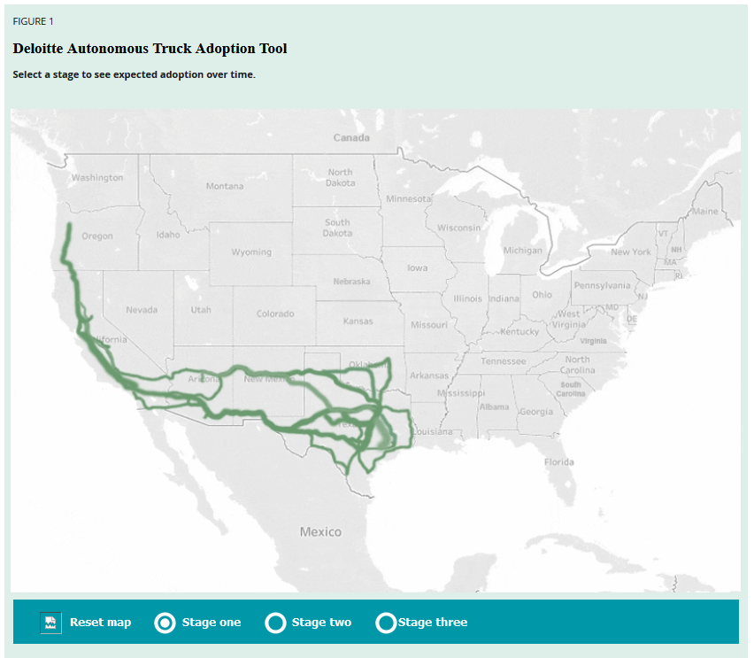

# Thriving vs Surviving - The Future of Driverless Driving

## A Brief History of Cruise
Cruise, [founded in 2013][1] by Kyle Vogt (co-founder of Justin.tv, which would later become Twitch.tv). Dan Kan – younger brother of a Justin.tv/Twitch.tv co-founder – joins the next year. Vogt was the main force of the company, having been [obsessed][2] with the notion of driverless cars since his teenage years.

In 2016 the company was sold to General Motors. Over the next couple years, GM, Softbank, and Honda invested over $6 billion into Cruise, including development of the Origin, an autonomous vehicle model. Cruise grew to over 1,000 employees. The T. Rowe Price investment firm added another $1.15 billion in 2019.

Cruise partnered with Walmart on a self-driving pilot program in Arizona, and Microsoft and the other established investors give another $2.75 billion, bringing the company’s valuation to more than $30 billion. Cruise vehicles have delivered meals to the homeless in San Francisco beginning in 2021.

Cruise’s taxi services (sometimes called “ridehailing” to distinguish themselves from taxi regulations) opened to the public in 2022. Revenue from customers doesn’t seem to be a major stream of income for Cruise, as the vast majority of the company’s existence has been as a recipient of R&D funding from major auto companies.

Vogt was CEO of Cruise during its rise, but he resigned in 2023 when the company was prohibited from operating in California following accidents and pedestrian injuries involving its driverless cars. In one case, a pedestrian was trapped beneath a Cruise vehicle and dragged for 20 feet.

## Money Flow and Technology
Cruise is an unusual company from a traditional perspective, because their business model of self-driving vehicles has raised enormous amounts of money without ever requiring customers. Almost all of their funding has come from direct investment from private companies, who themselves likely used Cruise as an R&D tax write-off.

The question of how feasible Cruise can be is less about meeting individual customers’ demands and more about how they can ingratiate themselves to private companies and the government. Insofar as Cruise “sells” anything, their driverless vehicles and the software which operates them are the primary products, and the buyer demographics would mostly be shipping or taxi-like companies, similar to other driverless vehicles. A 2021 estimate from Deloitte Insights put mile-dollar savings from automated trucks around 30%, from roughly $1.82 to $1.26, although this was before the recent spike in inflation.

Cruise’s edge in technology is the way they have built sensors into their vehicles – there are a few factors at play:
- They use a very advanced 3D simulation, with data for the CAD hardware parts of the vehicle andfor sensors that have not yet been physically built. This allows them to get accurate ideas of how sensor ranges would result in blind spots or low coverage around the vehicle. Traditional 1:1 hardware testing would require days or weeks for iterations such as these.
- Driving at high speeds can cause Radar sensors and video cameras to behave differently due to the travel time of radio waves and the “fisheye” effect in video, the vehicle must have a sensor array that can function at all speeds.
- Redundant cameras or LiDAR sensors to ensure the default “fields of view” are not occluded when taking corners or maneuvering in tight spaces. This is especially true for functions like parallel parking.

## The Driverless Landscape
Driverless vehicles essentially didn’t exist until the last decade, and advancements in computing power and AI learning methods have allowed the technology to grow astronomically. What was once pure science fiction is now a reality – at least for certain large urban centers like San Francisco. Within the last decade, the industry has shifted its focus from matters of plausibility to matters of practicality. Quibbles like how to administer parking tickets pale in comparison to the most serious question: How do we know for certain that a driverless vehicle is just as safe as a human-drive one? And if it isn’t safe, who is responsible?

There have been many jokes about what social clues a car should use in order to determine whom it should run over. In practice, the goal is that it doesn’t ever get into danger, or cause any human to be in danger. In the case of Cruise, they did not avoid that situation, and the company is currently under severe legal scrutiny in the state of California. The original founder and CEO has stepped down in the wake of two accidents involving Cruise vehicles and pedestrians, one of which was mentioned at the beginning of this report. Its vehicles no longer operate on the road and a full quarter of its workforce has been laid off.

Cruise’s future is a question of survival, not growth. Obstacles include:
- The necessity of some human oversight for vehicles on the road, which mitigates their usefulness in saving money or human effort.
- Making their service cheaper or better than taxis and Uber, which use traditional vehicles and whose drivers earn minimum wage or less.
- Operating in snow, or operating outside of very strictly defined geographical areas.
- Ensuring regulatory bodies and the general public that they can place their personal safety in the hands of a driverless vehicle.

## Recommendations
I believe there are three main things that Cruise can do to survive the hardships they will face in the coming years:
- Develop different AI personas to make the vehicles seem more human and approachable. The mass market will never truly be comfortable with nobody at the wheel, but having Robot Bob would give a social connection and make passengers feel more comfortable.
- Sensors on the bottom of the car to detect anything becoming caught, and perhaps audio sensors to detect people screaming in pain? Kind of grim, but I’m sure the PR dept will find a way to spin it.
- Make their decisionmaking algorithms open source. This won’t actually affect their bottom line much, if at all.

Cruise has indicated it plans to make itself more transparent by sharing data related to collisions and stops, but there is no way to know how useful this data will be or what exactly it will contain. Even the required phrasing in this report belies how difficult tracking accountability is: “a vehicle operated by Cruise was involved in an accident” vs “person charged with crime in accident.”

It’s one thing to guess how a static technology, like a traditional vehicle, will impact the public: the key detail about AI, whether used in image recognition or driving decisions, is that it is non-static. If a traditional car is a key, then a driverless car is a key that can change itself in our grasp to fit any lock we want – but it can also become a jagged mess of metal if it encounters an unseen type of deadbolt. Many people likely would not take that chance, to say nothing of traffic laws and driving etiquette.

## Sources

1. [Facts about Cruise](https://getcruise.com/media-resources/)

[1]: https://getcruise.com/media-resources/ (Facts about Cruise)

2. [This 29-Year-Old Entrepreneur Was Rejected by 35 Potential Employers. Now, He's the Co-Founder of a $1 Billion Startup. Here's How.](https://www.entrepreneur.com/leadership/this-29-year-old-entrepreneur-was-rejected-by-35-potential/274693)

[2]: https://www.entrepreneur.com/leadership/this-29-year-old-entrepreneur-was-rejected-by-35-potential/274693 (This 29-Year-Old Entrepreneur Was Rejected by 35 Potential Employers. Now, He's the Co-Founder of a $1 Billion Startup. Here's How.)

3. [Founder and CEO of GM’s self-driving car unit resigns in wake of safety problems](https://www.cnn.com/2023/11/20/business/gm-self-driving-ceo-resigns/index.html)
- Vogt resigns after pedestrian injuries involving Cruise vehicles

4. [A woman was found trapped under a driverless car. It wasn’t the first car to hit her](https://www.cnn.com/2023/10/03/tech/driverless-car-pedestrian-injury/index.html)
- Woman struck by car, then trapped beneath driverless car
https://getcruise.com/news/blog/2023/important-updates-from-cruise/
- Blog from company website released afterwards

5. [Autonomous trucks lead the way](https://www2.deloitte.com/us/en/insights/focus/future-of-mobility/autonomous-trucks-lead-the-way.html)
- Analysis of driverless trucking projected to save about %30 per mile-dollar (roughly 1.82 to 1.26)

6. [How Cruise Uses Simulation To Speed Up Our Sensor Development](https://getcruise.com/news/blog/2020/how-cruise-uses-simulation-to-speed-up-our-sensor-development/)
- Description of technology relating to sensor development and placement

7. [What’s next for robotaxis in 2024](https://www.technologyreview.com/2024/01/23/1086936/whats-next-for-robotaxis-2024/)
- Summary of what’s to come for robotaxis in 2024